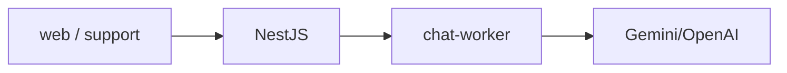

# Arquitetura PromptDesk

<h3>Como funciona</h3>
Um pedido vira job protegido, resposta de modelo com rank e atualização visível de status.

VERIFIED API NestJS + worker BullMQ + Postgres dual + Redis + Socket.IO de **status** (não streaming de tokens).

Detalhe: [English](/en/promptdesk/architecture).
